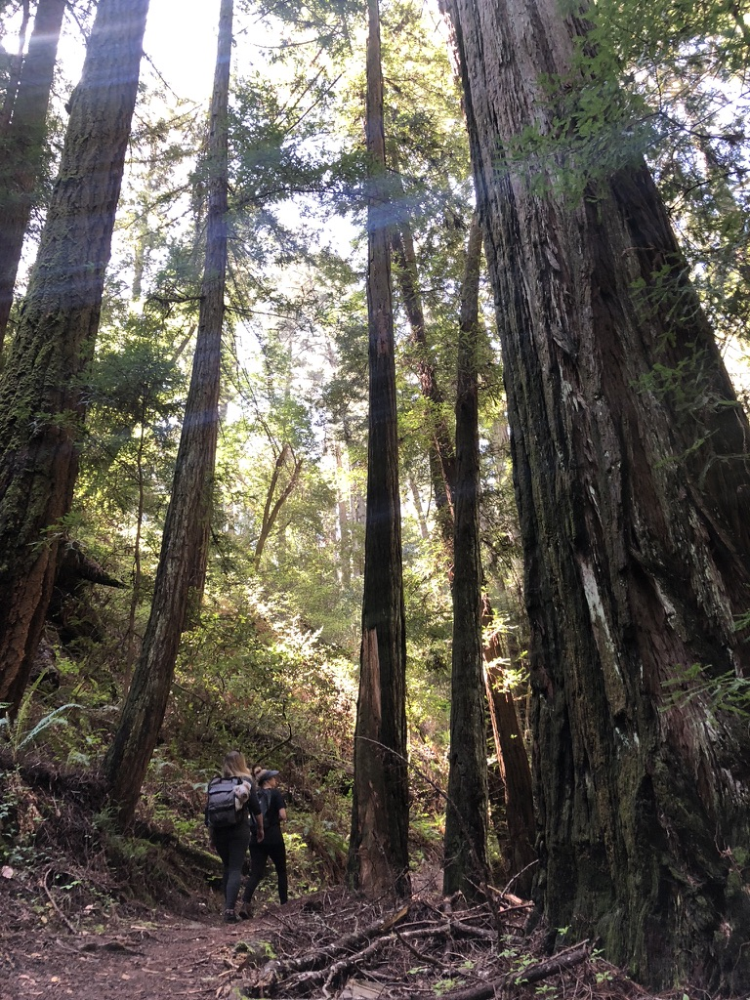
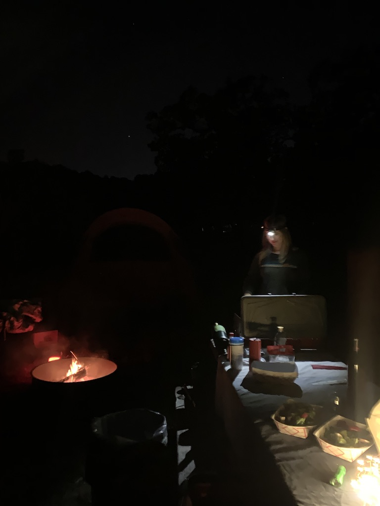

So, you've decided you're coming camping with the COOLEST camp ever. AWESOME! You're in for a treat!

### Activities
Unless we've scheduled something special, expect to spend a fair amount of time around
the camp site, enjoying the fresh air, the trees, the birds, and the great outdoors. Depending
on where we camp and our mood, we may go on a hike in the area as well, but you're not
obligated to hike with us.

In the evenings, we like to lounge around the campfire, listen to music, and enjoy some drinks, jokes, and good company. We can sometimes stay up pretty late, so be sure to bring some ear plugs
if you'd like to hit the snoozer early!

### What to bring
* **Drinks!** We like to be generous and share, but you probably should bring some for yourself as well so that there's enough for everyone. Please BYOB.
* **Sleeping bag.** We may have one extra available if you ask us to bring it, but we recommend that
  you bring your own so you're comfortable.
* **Tent.** Similarly, we may have one extra available if you ask us to bring it.
* **Lights.** You'll probably want to bring either a head lamp and/or a flashlight so you can safely
  maneuver around in the evenings. 
* **Chair.** For sitting around the campfire and chillin'.

### What to prepare
You should check the weather forecast on the days leading up to camping. We wouldn't want you
freezing yourself to death while camping with us, so please be prepared!

Also, be ready to have FUN! We love camping and love sharing our camp adventures with people
in our lives. We can't wait to have you join us at [Camp COOLMOVES](/coolmoves)!