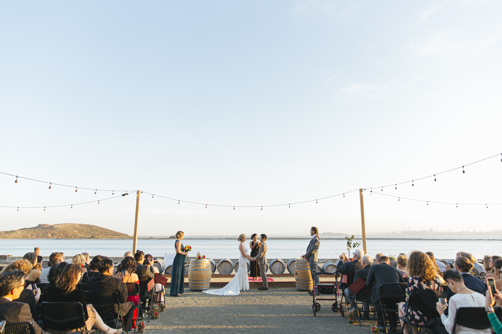

We are so incredibly grateful for everyone who was a part of our wedding day:
our harvest!

## Intentions
Celebration, Gratitude, Meaning, and FUN!

## Media
* [Official Wedding Photos](https://www.dropbox.com/sh/w8p41swmygbbihn/AADhlXiuOLSFZvxzLOt9zKOya?dl=0)
* [Making Of/Thanks Video](https://www.dropbox.com/s/u3zndcnc9hpey4w/Harvest%20Thanks.mp4?dl=0): a behind the scenes view of the making of the wedding as well as some scenes from our honeymoon in Thailand.

* [Photo Booth Photos](https://drive.google.com/drive/folders/1plRBbqKPJbTNHneqJsZfbk6afDsi8c1a?usp=sharing)
* #AdventuresOfAliAndIvan
    * [Instagram](https://www.instagram.com/explore/tags/AdventuresOfAliAndIvan/)
    * [Facebook](https://www.facebook.com/hashtag/adventuresofaliandivan)
* [To Ali & Ivan's Video](https://www.dropbox.com/s/trp1428dawxugjt/To%20Ali%20%26%20Ivan%27s%20Wedding.mp4?dl=0): a little video we sent to guests before the wedding to help folks know that they're not driving their doom and also doubled as a reminder for the upcoming big day. No stop signs were illegally run in the making of this video.
* [Ivan thinking about: Harvest](https://ivanthinking.net/thoughts/harvest/)
* [Coordinated Bridge Feature](https://thecoordinatedbride.com/latest-weddings/a-california-wedding-at-riggers-wine-loft-ali-ivan/)

### Venue: [Riggers Wine Loft](https://www.riggersloftwine.com/)
> Riggers was a perfect location for our October wedding!  The scenery was beautiful and the staff were all very helpful.  We had two bartenders who were friendly and fun.  Barbara, one of the owners, was especially helpful when we had some last minute issues with the venue setup, and was able to work with us to make it perfect.  Our guests had a great time!  I highly recommend this venue for an event!

[Facebook](https://www.facebook.com/riggersloft/)

### Coordinator: [Two Perfect Events](https://twoperfectevents.com/) 
> We hired Two Perfect Events as the coordinator for our October wedding in Richmond, CA.  I had found the company by reading a real wedding story on the "A Practical Wedding" website that featured a Bay Area wedding with a traditional Chinese Tea Ceremony, in addition to a Western style ceremony.  That is exactly what my fiancé and I had in mind, so I reached out to Leah.  She responded instantly (which is the norm for her!).  After taking the time to walk me through her services and the contract, I decided to spend the money and hire her.  I can honestly say that it was the best decision of the wedding.  Leah and her assistant, Yoko, were on top of absolutely all the details leading up to the wedding day, including assisting us with some last minute issues about the setup at the venue.  They thought about details that would have never even crossed our minds!  The timeline and transition between the Tea Ceremony and the Western Ceremony were seamless.  Leah's help on planning the day-of timeline and just being a resource for us to ask questions prior to the wedding was so helpful and reassuring.  Leah and Yoko are organized, responsive, calm and capable.  During the wedding, Leah and Yoko kept checking on us to see if we needed anything, and making sure we ate and had a drink!  They expertly navigated real-time changes to schedule and location and made our wedding day absolutely stress-free. Seriously, BEST DECISION EVER!  I highly recommend Two Perfect Events!

[Facebook](https://www.facebook.com/twoperfectevents/), [Instagram](https://www.instagram.com/twoperfectevents/)

### Pork buns: [Chairman Bao](https://www.hailthechairman.com/)
> The Chairman Truck was perfect for our October wedding.  We wanted a food choice to reflect the Chinese heritage of my fiancé, but didn't want to do a traditional banquet.  The food truck was a perfect unique and delicious solution.  The we created a menu that consisted of a variety of steamed buns (meat, poultry, and veg options) and baked buns (meat, poultry, and veg options).  The Chairman Truck staff were well organized and so easy to work with.  They were responsive, clear in the pricing, professional, and delivered exactly what we expected.  I would definitely recommend The Chairman Truck, and all our guests let us know the food was bomb!

[Facebook](https://www.facebook.com/TheChairmanTruck/)

### Pizza: [Lucia's Pizzeria](https://www.luciasberkeley.com/)
> We hired Lucia's for our October wedding in Richmond, CA.  The food was absolutely great.  Our guests loved the mobile pizza oven!  Lucia's was able to accommodate the dietary needs of all our guests by providing a mix of pizzas including meat or vegetarian options, and the option for vegan and gluten free pizzas too.

[Facebook](https://www.facebook.com/LuciasBerkeley/)

### Donuts: [Johnny Donuts](https://johnnydoughnuts.com/)
> We hired Johnny Donuts donut truck for our October wedding in Richmond, CA.  It was great to have the truck roll up and surprise our guests with this treat!  The donuts are gourmet and delicious, and I would definitely recommend them for any event.  We did have some responsiveness lags and issues about what exactly was included in the contract, but between the time the initial contract was done and the wedding, the company replaced the person who had been handling the bookings.  I am confident that with the new staffing the responsiveness and contracts will go more smoothly.  Thanks to Johnny Donuts for a great experience!

[Facebook](https://www.facebook.com/doughnuttruck)

### Photography: [Carmen Holt Photography](http://www.carmenholt.com/)
> We hired Carmen as the photographer for our "warehouse-turned-winery" wedding in Richmond, CA, and she was absolutely fantastic.  She executed our vision of elegance with a backdrop of industrial grit to perfection.  Our wedding site was very different than a typical Northern California venue, so being able to work to understand the aesthetic we wanted and take artistic license with our vision was exactly what we wanted.  She and her second shooter, Elena, were so fun to work with, kept us on schedule, and were amazing people.  We had so much fun, and I give Carmen Holt Photography the highest recommendation possible!

### Make-up and hair: [Chels Kay Beauty](https://www.instagram.com/chelskay.beautyco/)
> I hired Chelsey for hair and makeup for me (bride), bridal party, and mother of bride/groom services for my October wedding in Richmond, CA.  Chelsey was an absolute dream to work with.  We did a trial for hair and makeup in July, which gave us plenty of time to think about tweaks to the look.  Day-of, she was great at staying on schedule, and super accommodating when we had added ladies wanting hair/makeup services at the last minute.  She was able to accomplish great styles on short hair, long hair, up-dos, hair extensions and softer looks.  Her range for styling is very impressive and she is so fun and easy to work with.  Our wedding had two ceremonies in one day, and she was able to do a makeup refresh between them, which was a lifesaver after being out in the hot October sun.  I highly recommend Chelsey for any hair and makeup needs!

### DJ/Music: [Golden Bell Music](https://goldenbellmusic.com/) 
> If you want your crowd to be dancing, Golden Bell are hands-down the best DJs out there.  We had seen members of the Golden Bell collective perform at other weddings, events, and clubs, and knew we had to have them for our wedding.  We mostly dealt directly with Chris Hoog at Golden Bell.  He was professional, willing to listen to our vision for the vibe of the wedding, and provided very helpful recommendations as far as venue set up.  He even recommended that we add a drummer to the lineup which was a great decision.  The addition of the drummer really gave us that live band dance party feeling that we wanted.  During the wedding, you could tell that the DJs were having a great time and the crowd was totally into the music!  I highly recommend Golden Bell for any event!

[Facebook](https://www.facebook.com/goldenbellproductions/)

### Rings: [Seelenbacher Jewelers](https://www.seelenbacherjewelers.com)
> Chris Seelenbacher is our go-to jeweler after working with him for my engagement ring and both my and my husband's wedding bands.  He is an absolutely honest business owner and a fine jeweler.  We described our vision for our rings and he was able to custom craft exactly what we wanted.  Chris is definitely our long term jeweler for life, and I look forward to receiving many of his creations from my husband in the years to come!!

[Facebook](https://www.facebook.com/pages/Seelenbacher-Jewelers/133975733320613)

### Others
* Officiant: Soniyah Singh, [Finding Bliss](https://www.finding-bliss.com/)
* Craftacular venue: Mark Slee, [Heron Arts](https://heronarts.com/)
* Photo van: [Photovanic](https://www.photovanic.com/), [Facebook](https://www.facebook.com/photovanic/)
* Wedding Banner: Liz Merolla, [Sweet Tarnation](https://sweettarnation.com/)

